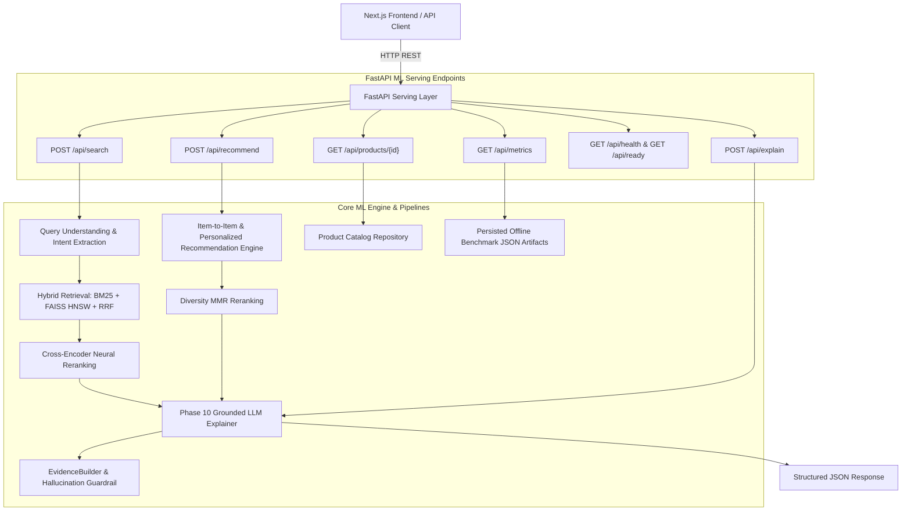

# FastAPI ML Serving Layer & Production API Architecture

This document details the production-style FastAPI serving layer for the Amazon-inspired multi-stage semantic product search, cross-encoder reranking, personalized recommendations, and grounded explanations system.

---

## 1. System Integration Architecture

The API exposes the existing multi-stage ML components via a clean, stateless REST interface:



---

## 2. API Endpoints Reference

### 2.1. `POST /api/search` (and `POST /api/v1/search`)
Executes full multi-stage semantic search: Query Understanding $\to$ Hybrid Retrieval $\to$ Cross-Encoder Reranking $\to$ Optional Grounded Explanations.

#### Request Schema (`SearchRequest`)
```json
{
  "query": "gaming laptop under 85000 with RTX GPU and 16GB RAM",
  "top_k_retrieval": 100,
  "top_k_reranking": 20,
  "enable_reranking": true,
  "enable_explanation": true,
  "ranking_strategy": "cross_encoder"
}
```

#### Response Schema (`SearchResponse`)
```json
{
  "query": "gaming laptop under 85000 with RTX GPU and 16GB RAM",
  "query_understanding": {
    "raw_query": "gaming laptop under 85000 with RTX GPU and 16GB RAM",
    "normalized_query": "gaming laptop rtx gpu 16gb ram",
    "category": "Laptops",
    "price_max": 850.0,
    "attributes": {
      "gpu": ["RTX"],
      "ram": ["16GB"]
    },
    "confidence": 1.0
  },
  "total_retrieved": 100,
  "total_returned": 20,
  "results": [
    {
      "product": {
        "asin": "B08N5WRWNW",
        "title": "Acer Nitro 5 AN515 Gaming Laptop (RTX 4060, 16GB RAM)",
        "price": 799.99,
        "brand": "Acer",
        "average_rating": 4.5,
        "rating_count": 2380
      },
      "final_score": 5.412,
      "retrieval_signal": {
        "stage": "dense_retrieval",
        "initial_score": 0.8812,
        "initial_rank": 3
      },
      "rerank_signal": {
        "stage": "cross_encoder",
        "rerank_score": 5.412,
        "rerank_rank": 1
      },
      "explanation": "Recommended product: Categorized under 'Laptops' and listed price ($799.99) is within budget.",
      "grounded_explanation": {
        "product_id": "B08N5WRWNW",
        "summary": "Recommended product: Categorized under 'Laptops' and listed price ($799.99) is within budget.",
        "reasons": [
          {
            "type": "constraint_match",
            "label": "Budget",
            "text": "Listed price ($799.99) is within the requested $850.00 limit",
            "evidence": "$799.99",
            "is_matched": true
          }
        ],
        "grounded": true,
        "warnings": [],
        "generation_method": "deterministic_fallback"
      }
    }
  ],
  "timings": {
    "query_understanding_ms": 1.24,
    "dense_retrieval_ms": 6.85,
    "cross_encoder_rerank_ms": 32.10,
    "business_ranking_ms": 0.15,
    "explanation_generation_ms": 0.42,
    "total_latency_ms": 40.76
  }
}
```

---

### 2.2. `POST /api/recommend` (and `POST /api/v1/recommend`)
Generates personalized user recommendations or item-to-item complementary recommendations.

#### Request Schema (`RecommendRequest`)
```json
{
  "asin": "B08N5WRWNW",
  "user_history_asins": ["B08N5WRWNW"],
  "top_k": 10,
  "strategy": "hybrid",
  "lambda_diversity": 0.70,
  "generate_explanations": true
}
```

#### Response Schema (`RecommendResponse`)
```json
{
  "anchor_asin": "B08N5WRWNW",
  "strategy": "hybrid",
  "total_returned": 10,
  "recommendations": [
    {
      "product": {
        "asin": "B084G3K539",
        "title": "Acer Nitro Gaming Mouse II",
        "price": 29.99,
        "brand": "Acer"
      },
      "score": 0.892,
      "recommendation_type": "hybrid",
      "signals": {
        "content_similarity": 0.81,
        "collaborative_co_occurrence": 0.94,
        "popularity": 0.72
      },
      "reasons": [
        "Shares category with currently viewed product",
        "From the same trusted brand (Acer)"
      ],
      "grounded_explanation": { ... }
    }
  ],
  "execution_time_ms": 4.12
}
```

---

### 2.3. `POST /api/explain` (and `POST /api/v1/explain`)
Generates structured, zero-hallucination explanations directly from the Phase 10 `GroundedExplainer`.

#### Request Schema (`ExplainRequest`)
```json
{
  "query": "Sony noise cancelling headphones with 8-hour battery",
  "product_id": "B00001W0DI"
}
```

#### Response Schema (`GroundedExplanation`)
```json
{
  "product_id": "B00001W0DI",
  "summary": "Recommended product: Categorized under 'Headphones' and manufactured by Sony.",
  "reasons": [
    {
      "type": "constraint_match",
      "label": "Brand",
      "text": "Manufactured by Sony",
      "evidence": "Sony",
      "is_matched": true
    },
    {
      "type": "unsupported_constraint",
      "label": "Missing Info",
      "text": "Battery capability requested in query but not listed in product evidence is not specified in the verified product catalog metadata.",
      "evidence": "Not available in catalog",
      "is_matched": false
    }
  ],
  "grounded": true,
  "warnings": [
    "Battery capability requested in query but not listed in product evidence is not specified in the verified product catalog metadata."
  ],
  "generation_method": "deterministic_fallback"
}
```

---

### 2.4. `GET /api/products/{id}`
Returns verified product metadata from catalog repository. If the product ASIN is not found, returns HTTP 404.

---

### 2.5. `GET /api/health` & `GET /api/ready`
- `GET /api/health`: Lightweight HTTP 200 alive ping.
- `GET /api/ready`: Full system readiness and diagnostics (catalog size, vector index document count, neural model status, explainer mode).

---

### 2.6. `GET /api/metrics`
Exposes the authoritative offline benchmark results (`experiments/*/*.json`) without executing expensive re-runs.

---

## 3. How to Run the API Server

### Development Server
```bash
uvicorn backend.app.main:app --host 0.0.0.0 --port 8000 --reload
```

### Interactive Documentation
- Swagger UI: `http://localhost:8000/docs`
- ReDoc: `http://localhost:8000/redoc`
- OpenAPI JSON: `http://localhost:8000/openapi.json`
