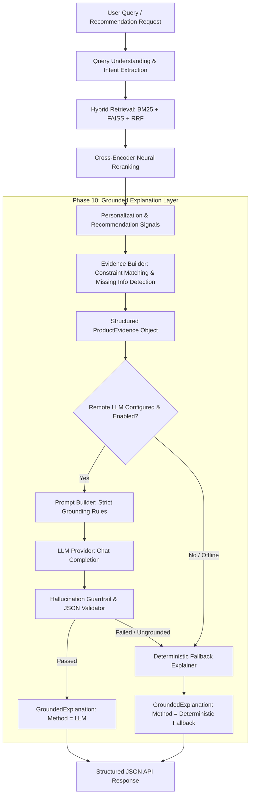

# Grounded LLM Product Explanations & Transparency Architecture

This document describes the design, evidence boundaries, hallucination guardrails, and deterministic fallback mechanisms for **Phase 10 Grounded LLM Product Explanations**.

---

## 1. Objective & Design Philosophy

The explanation subsystem answers a fundamental e-commerce user question:
> **"Why was this product recommended or retrieved for my search query or profile?"**

### Core Grounding Axioms
1. **Strict Factual Grounding**: Explanations are constructed **exclusively from structured evidence** emitted by upstream pipeline stages (Query Understanding, Hybrid Retrieval, Cross-Encoder Reranking, and Personalization).
2. **Zero Hallucination Tolerance**: The LLM is strictly prohibited from inventing specifications, battery runtimes, compatibility details, warranties, discounts, or shipping information not present in the verified catalog metadata.
3. **Explicit Missing-Constraint Disclosure**: When a user query requests a capability or constraint absent from the catalog evidence (e.g., "8-hour battery" on a product lacking battery metadata), the system **must explicitly flag the constraint as unverified** rather than fabricating a claim.
4. **Deterministic Fallback Reliability**: If an external LLM is offline, unconfigured, or produces an ungrounded claim, the system seamlessly falls back to a deterministic, rule-grounded explanation generator without degrading search latency or availability.
5. **No Benchmark Mutation**: The explanation layer consumes existing pipeline outputs as a read-only presentation stage and does not modify the validated benchmark JSON files, retrieval algorithms, or ranking metrics.

---

## 2. End-to-End Explanation Pipeline



---

## 3. Structured Product Evidence Schema

Before any explanation is generated, the `EvidenceBuilder` compiles a comprehensive `ProductEvidence` object from the catalog record and upstream diagnostic signals:

```python
class ProductEvidence(BaseModel):
    query: Optional[str]                    # Original raw user query
    product_id: str                         # Canonical ASIN / parent_asin
    product_title: str                      # Full verified product title
    price: Optional[float]                  # Listed price
    currency: str                           # Currency code (e.g., USD)
    rating: Optional[float]                 # Average customer star rating
    rating_count: int                       # Total customer rating count
    brand: Optional[str]                    # Verified catalog brand
    category: Optional[str]                 # Canonical category
    categories: List[str]                   # Full taxonomy hierarchy
    features: List[str]                     # Verified bullet points
    description: Optional[str]              # Description snippet
    attributes: Dict[str, Any]              # Verified technical attributes
    query_constraints: Dict[str, Any]       # Extracted query constraints
    retrieval_provenance: Dict[str, Any]    # BM25 / Dense / RRF ranks and scores
    cross_encoder_evidence: Dict[str, Any]  # Cross-Encoder score and reranked rank
    personalization_evidence: Dict[str, Any]# User history & item-to-item co-occurrence
    matched_constraints: Dict[str, str]     # Verified constraint-match descriptions
    missing_constraints: List[str]          # Requested query constraints NOT in evidence
```

---

## 4. Hallucination Safeguard Boundary & Missing Attribute Protocol

### Negative Constraint Verification
If a query contains a constraint (e.g., `"Sony wired studio headphones with 8-hour battery"`), the `EvidenceBuilder` verifies whether the term or specification exists in the verified product record:
- If present: Added to `matched_constraints`.
- If absent: Registered in `missing_constraints` (e.g., `["Battery capability requested in query but not listed in product evidence"]`).

### Guardrail Enforcement
The `HallucinationGuardrail` inspects the raw output from the LLM before it is accepted:
1. Validates schema adherence against `GroundedExplanation`.
2. Inspects all reasons with `is_matched=True` to confirm that their `evidence` tokens exist within the verified `ProductEvidence` corpus.
3. If an LLM attempts to claim a match on a constraint listed under `missing_constraints` using fictitious evidence, the guardrail **rejects the response** and triggers deterministic fallback generation.

---

## 5. Grounded Explanation Output Schema

The output model (`GroundedExplanation`) provides transparent, structured rationales:

```json
{
  "product_id": "B08N5WRWNW",
  "summary": "Recommended product: Categorized under 'Laptops' and listed price ($799.99) is within the requested $850.00 limit.",
  "reasons": [
    {
      "type": "constraint_match",
      "label": "Category",
      "text": "Categorized under 'Laptops'",
      "evidence": "Laptops",
      "is_matched": true
    },
    {
      "type": "constraint_match",
      "label": "Budget",
      "text": "Listed price ($799.99) is within the requested $850.00 limit",
      "evidence": "$799.99",
      "is_matched": true
    },
    {
      "type": "constraint_match",
      "label": "Specification",
      "text": "Feature verified: 'NVIDIA GeForce RTX 4060 Laptop GPU with 8GB dedicated GDDR6 VRAM'",
      "evidence": "Feature verified: 'NVIDIA GeForce RTX 4060 Laptop GPU with 8GB dedicated GDDR6 VRAM'",
      "is_matched": true
    },
    {
      "type": "ranking_strength",
      "label": "Neural Relevance",
      "text": "Ranked #1 with high query-product cross-attention relevance (5.41).",
      "evidence": "Cross-Encoder Score: 5.4120",
      "is_matched": true
    }
  ],
  "semantic_match_score": 5.412,
  "grounded": true,
  "warnings": [],
  "generation_method": "deterministic_fallback"
}
```

When missing constraints are encountered:
```json
{
  "product_id": "B00001W0DI",
  "summary": "Recommended product: Categorized under 'Headphones' and manufactured by Sony.",
  "reasons": [
    {
      "type": "constraint_match",
      "label": "Category",
      "text": "Categorized under 'Headphones'",
      "evidence": "Headphones",
      "is_matched": true
    },
    {
      "type": "constraint_match",
      "label": "Brand",
      "text": "Manufactured by Sony",
      "evidence": "Sony",
      "is_matched": true
    },
    {
      "type": "unsupported_constraint",
      "label": "Missing Info",
      "text": "Battery capability requested in query but not listed in product evidence is not specified in the verified product catalog metadata.",
      "evidence": "Not available in catalog",
      "is_matched": false
    }
  ],
  "semantic_match_score": null,
  "grounded": true,
  "warnings": [
    "Battery capability requested in query but not listed in product evidence is not specified in the verified product catalog metadata."
  ],
  "generation_method": "deterministic_fallback"
}
```

---

## 6. LLM Configuration & Environment Variables

| Variable | Default | Description |
| :--- | :--- | :--- |
| `ENABLE_LLM_EXPLANATIONS` | `false` | Enable remote LLM calls for explanation generation (defaults to deterministic fallback) |
| `OPENAI_API_KEY` | `""` | API key for OpenAI-compatible LLM endpoint (never committed to repository) |
| `LLM_MODEL_NAME` | `"gpt-4o-mini"` | Target LLM model name |
| `OPENAI_BASE_URL` | `"https://api.openai.com/v1"` | Optional custom OpenAI-compatible API base URL |

---

## 7. Performance & Efficiency

To maintain fast search and recommendation latency:
- Explanations are computed **only for the top $N$ displayed products** (default $N=5$) rather than the entire retrieval candidate pool ($K=100$).
- When LLM inference is disabled or unavailable, `FallbackExplainer` generates structured, zero-hallucination explanations in **$< 0.5$ ms per item** with zero external network overhead.
